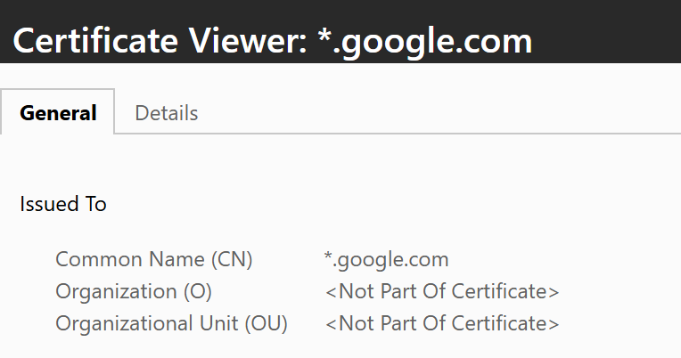

> 灵感来源：网上冲浪的时候就点开了youtube网址旁边那个小锁，我很好奇为什么显示的是*.google.com呢？就去查了一下，原来SSL证书可以一书多用，就尝试着申请了一下
> 

这种方法的**好处**就是：便于多域名管理
## 把需要申请证书的域名全部CNAME到另一个域名
这样就**不用每个域名**都添加TXT记录了，也方便后面的自动续期
比如我有
```
songhappy.cn
mirror.sh.cn
szu.sh.cn
szuoj.cn
sh0.cn
```
要申请共用证书，这里全部给他们添加CNAME记录`_acme-challenge`到`_acme-challenge.061224.xyz`
然后找一下061224.xyz是在腾讯云，拿一下SecretId和SecretKey


## 下载acme.sh
```bash
curl https://get.acme.sh | sh -s email=youremail
source ~/.bashrc
```

## 申请证书
先添加环境变量
```bash
export Tencent_SecretId="yourskid"
export Tencent_SecretKey="yourskey"
```
> 不同厂商前面api的名字不同，请查阅相关文档[acmesh-official/acme.sh](https://github.com/acmesh-official/acme.sh)

使用以下命令批量申请证书
```bash
acme.sh --issue \
  -d songhappy.cn -d *.songhappy.cn \
  -d szuoj.cn -d *.szuoj.cn \
  -d mirror.sh.cn -d *.mirror.sh.cn \
  -d szu.sh.cn -d *.szu.sh.cn \
  -d sh0.cn -d *.sh0.cn \
  --challenge-alias 061224.xyz \
  --dns dns_tencent \
  --server letsencrypt
```

## 完成
```
/root/.acme.sh/songhappy.cn_ecc/songhappy.cn.cer
/root/.acme.sh/songhappy.cn_ecc/songhappy.cn.key
/root/.acme.sh/songhappy.cn_ecc/ca.cer
/root/.acme.sh/songhappy.cn_ecc/fullchain.cer
```

得到这些文件

| **文件名**              | **对应角色**          | **详细解释**                                                                | **Nginx** **配置项**     |
| -------------------- | ----------------- | ----------------------------------------------------------------------- | --------------------- |
| **songhappy.cn.key** | **私钥** 🔑 (最重要)   | **千万不能泄露给别人！** 这是服务器用来解密数据的“钥匙”。如果它丢了，别人就能伪造你的网站。                       | `ssl_certificate_key` |
| **fullchain.cer**    | **完整证书** 📜 (最常用) | **这是给 Nginx/Apache** **用的。** 它包含了“你的证书”+“颁发机构的中间证书”。 浏览器需要这一整套才能信任你的网站。 | `ssl_certificate`     |

## 如果不需要了，需要移除域名
先看当前哪些证书会被自动续期：
```
acme.sh --list
```

把某个域名从续期列表移除：
```
acme.sh --remove -d example.com
# 如果是 ECC 证书再加 --ecc
acme.sh --remove -d example.com --ecc
```

如果`acme.sh`彻底不想用了
```
acme.sh --uninstall
```