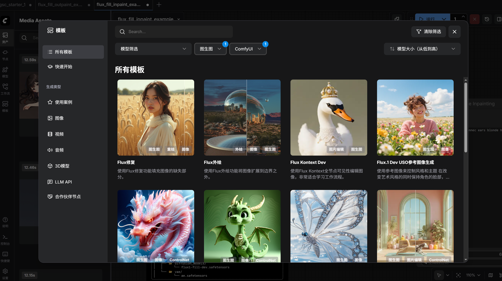
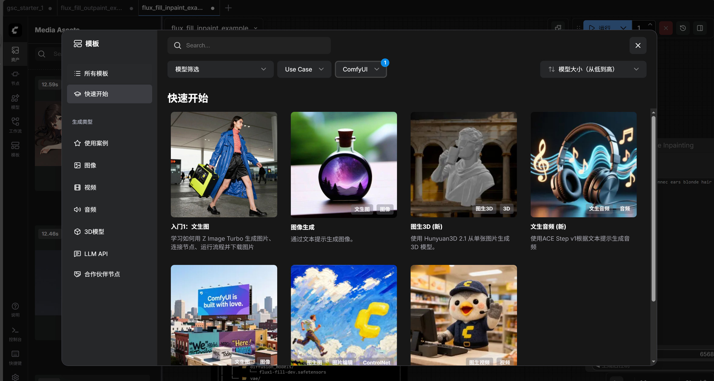
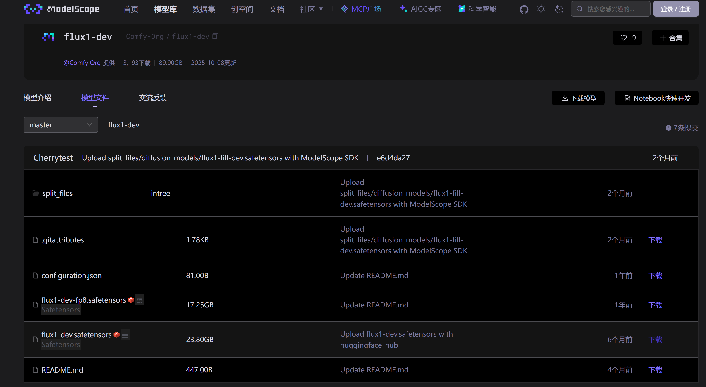

**ComfyUI** 是一个基于**节点（Node）工作流**的本地 AI 图像生成工具，主要用于 **Stable Diffusion** 及其衍生模型。它用“搭积木”的方式，把复杂的生成流程拆解成可视化节点，让你对每一步都能精细控制 

## 安装与启动
### 下载源码
```
git clone https://github.com/comfyanonymous/ComfyUI.git

cd ComfyUI
```

### 创建并激活虚拟环境
```
conda create -n comfy python=3.11 -y

conda activate comfy
```

### 安装必要环境
```
python -m pip install -U pip

pip install torch torchvision torchaudio --index-url https://download.pytorch.org/whl/cu124

pip install -r requirements.txt

pip install -r manager_requirements.txt

```

### 启动
> 这里是在第8张显卡启动，绑定端口127.0.0.1:7878
```
python main.py --enable-manager --cuda-device 7 --listen 127.0.0.1 --port 7878
```

### 查看
为了安全性，使用ssh隧道
```
ssh -L 7878:127.0.0.1:7878 username@serverip
```


## 进入并配置
界面如图所示



可以点击快速开始
使用第一个（入门1：文生图）测试
点击之后提示缺少模型，有下载链接，默认是从hugingface下载，国内下载慢或者不可达，可以复制镜像名然后到[魔搭社区](https://www.modelscope.cn/home)下载
比如[Comfy-Org/flux1-dev · Hugging Face](https://huggingface.co/Comfy-Org/flux1-dev)，直接在魔塔社区**搜索Comfy-Org/flux1-dev下载safetensors文件**即可

> 模型下载好按照提示放到model/下的对应文件夹即可
