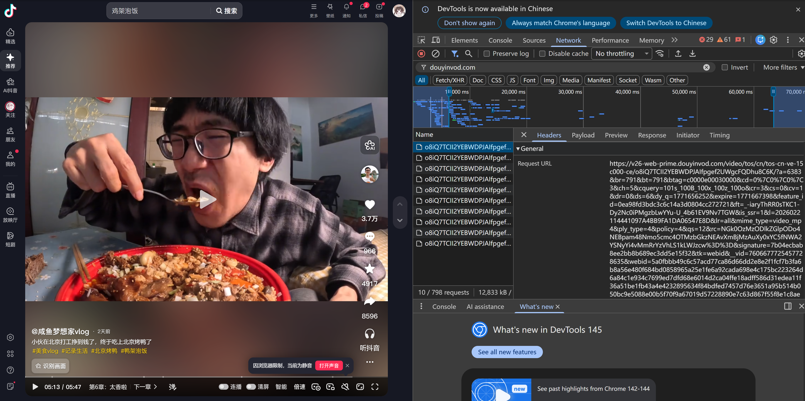
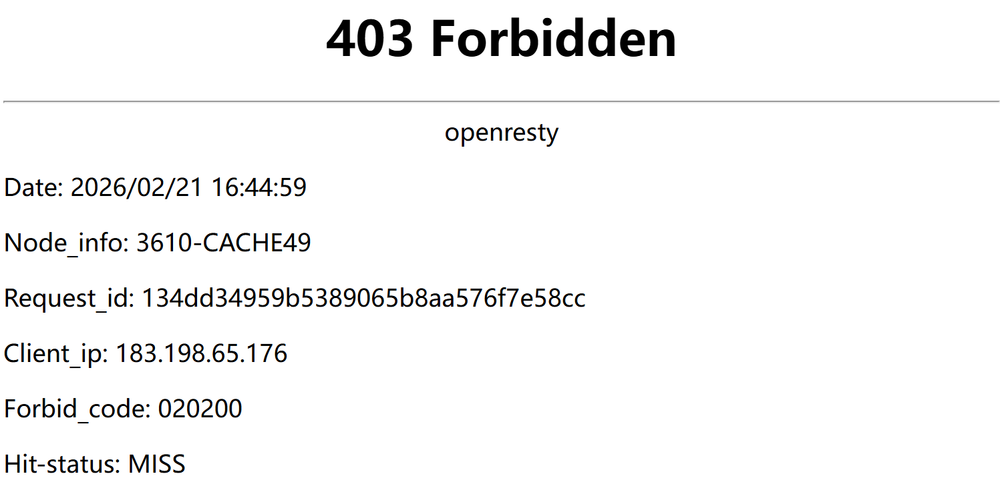

先把两个链接放在前面
[YusongXiao/douyin_phaser: 抖音视频/图集/动图直链提取工具，支持 4K，提供 CLI 和 FastAPI API 服务。](https://github.com/YusongXiao/douyin_phaser)
[YusongXiao/douyin_downloader](https://github.com/YusongXiao/douyin_downloader)

---

之前想玩**AI生图**和**LoRA微调**需要部分数据集
想到了抖音上有很多媒体，分析了一下
直接逆向还是太麻烦了，于是决定牺牲性能，直接用playwright模拟出来一个无头浏览器来自动解决一系列的**反爬机制和签名**
注意到抖音的媒体是直接放在CDN存储桶的
简单分析一个链接可以得到带签名的存储桶链接，访问的时候加上Referer头www.douyin.com即可**查看和下载**



所以，下载抖音的一个作品，可以先将**分享链接**解析为**CDN存储桶链接**，然后加上Referer头进行下载
如果我们想要某个作者的所有作品，可以先把作者主页链接解析为多个分享链接，再复用前面的方案，从而下载

所以一共两个项目 [YusongXiao/douyin_phaser](https://github.com/YusongXiao/douyin_phaser) 和 [YusongXiao/douyin_downloader](https://github.com/YusongXiao/douyin_downloader)
## douyin_phaser
两个api接口，输出json格式的解析链接
### douyin_phaser_api
输入分享链接，输出作品标题、作者名字、视频封面和CDN存储桶等地址
https://v.douyin.com/5VzgDKB5EQc/
```json
{
  "code": 0,
  "message": "success",
  "data": {
    "title": "20块买一桶泡面一个鸡腿，放石板上烧烤一下，鲜美可口太好吃了 在超市用20块，买了一桶汤达人方便面，一个琵琶鸡腿，还有一包手剥笋，回到营地后，放石板上烧烤营养丰富的鸡腿泡面，出锅时色香味俱全，尝一口鲜美可口，爽滑入味真是太好吃了#泡面神仙吃法 #方便面的神仙吃法 #户外美食 #吃泡面 #鸡腿面",
    "author": "肉吃面条",
    "author_id": "MS4wLjABAAAAhoscX-EwNKdZHbUTPeU_0QnlnUUtOTs9Q2RKTGJ1n6Y",
    "cover": "https://p3-pc-sign.douyinpic.com/image-cut-tos-priv/7d5e0d6d43b62fab29c36df6d897d963~tplv-dy-resize-origshort-autoq-75:330.jpeg?lk3s=138a59ce&x-expires=2087020800&x-signature=JnBf3i5dTAWyt5cPY6c4Av9wa3E%3D&from=327834062&s=PackSourceEnum_AWEME_DETAIL&se=false&sc=cover&biz_tag=pcweb_cover&l=20260221162031412850A0A32C09A4E697",
    "type": "video",
    "items": [
      {
        "type": "video",
        "video_url": "https://v26-web.douyinvod.com/463e8d4499ab464e47f6036f77ca6b50/699995f0/video/tos/cn/tos-cn-ve-15/oMaSALYKRwBliBbIsAE1dwzdPAZEAviI2Q98S/?a=6383&ch=26&cr=3&dr=0&lr=all&cd=0%7C0%7C0%7C3&cv=1&br=5836&bt=5836&cs=0&ds=4&ft=AJkeU_TERR0sTKC1-Dy2Nc0iPMgzbLu7vu-U_4b61EV9Nv7TGW&mime_type=video_mp4&qs=0&rc=Ozo0NDc6M2k1ZDM5O2c8N0Bpandudm05cnY3OTMzNGkzM0AxLjI0NGI2Ni8xNV81Xi4yYSNiLjBuMmRrLi9hLS1kLTBzcw%3D%3D&btag=80000e00030000&cquery=100H_100K_100o_100w_100B&dy_q=1771662031&feature_id=0ea98fd3bdc3c6c14a3d0804cc272721&l=20260221162031412850A0A32C09A4E697",
        "cover_url": "https://p3-pc-sign.douyinpic.com/image-cut-tos-priv/7d5e0d6d43b62fab29c36df6d897d963~tplv-dy-resize-origshort-autoq-75:330.jpeg?lk3s=138a59ce&x-expires=2087020800&x-signature=JnBf3i5dTAWyt5cPY6c4Av9wa3E%3D&from=327834062&s=PackSourceEnum_AWEME_DETAIL&se=false&sc=cover&biz_tag=pcweb_cover&l=20260221162031412850A0A32C09A4E697"
      }
    ]
  }
}
```

### douyin_user_phaser_api
输入用户主页链接，输出作者作者名字、个性签名、作品数量以及各作品的描述和分享链接等

```json
{
  "code": 0,
  "message": "success",
  "data": {
    "user": {
      "nickname": "一只小包",
      "sec_uid": "MS4wLjABAAAAL_K7-nnJ3ORDmGZC6Q9L8MmEMHAAa9zoCoXxn27qvmw",
      "uid": "86235347945403",
      "avatar": "https://p3-pc.douyinpic.com/aweme/100x100/aweme-avatar/tos-cn-avt-0015_6433ae51c6bceaa30e038268a937d295.jpeg?from=327834062",
      "signature": "谢谢宝宝们喜欢～ 希望你们开心～ᗴ͜ꩰ（ ∩_   ̫ _∩ ）ꩰ͜ᗱ\n🈴：XB00ll\n无隔壁 只有这一个号",
      "aweme_count": 14
    },
    "works_count": 14,
    "works": [
      {
        "aweme_id": "7608160295018535417",
        "type": "video",
        "desc": "整个村里  萌妹子躲好！",
        "share_url": "https://www.douyin.com/video/7608160295018535417",
        "is_top": true,
        "create_time": 1771412860
      },
      {
        "aweme_id": "7606592976957388102",
        "type": "video",
        "desc": "确定就是还不确定",
        "share_url": "https://www.douyin.com/video/7606592976957388102",
        "is_top": true,
        "create_time": 1771047947
      },
      {
        "aweme_id": "7608910705241159546",
        "type": "video",
        "desc": "如果泪水比爱多 那我们就到此为止吧",
        "share_url": "https://www.douyin.com/video/7608910705241159546",
        "create_time": 1771587577
      },
      {
        "aweme_id": "7608438823009985018",
        "type": "video",
        "desc": "跟着我追～",
        "share_url": "https://www.douyin.com/video/7608438823009985018",
        "create_time": 1771477710
      },
      {
        "aweme_id": "7608088637008391929",
        "type": "video",
        "desc": "mua是什么梗 为什么没有人跟我说",
        "share_url": "https://www.douyin.com/video/7608088637008391929",
        "create_time": 1771396176
      },
      {
        "aweme_id": "7607699026600091249",
        "type": "video",
        "desc": "dj dj 给我一条k！",
        "share_url": "https://www.douyin.com/video/7607699026600091249",
        "create_time": 1771305465
      },
      {
        "aweme_id": "7607326930375656825",
        "type": "video",
        "desc": "小坏蛋",
        "share_url": "https://www.douyin.com/video/7607326930375656825",
        "create_time": 1771218833
      },
      {
        "aweme_id": "7606970987598440293",
        "type": "video",
        "desc": "宝宝降温了，记得多穿衣服哦",
        "share_url": "https://www.douyin.com/video/7606970987598440293",
        "create_time": 1771135957
      },
      {
        "aweme_id": "7605848129137960659",
        "type": "video",
        "desc": "你不乘哦～",
        "share_url": "https://www.douyin.com/video/7605848129137960659",
        "create_time": 1770874520
      },
      {
        "aweme_id": "7605472578749151423",
        "type": "video",
        "desc": "嘎嘎嘎",
        "share_url": "https://www.douyin.com/video/7605472578749151423",
        "create_time": 1770787076
      },
      {
        "aweme_id": "7605089243116112369",
        "type": "video",
        "desc": "嘟嘟.嘟嘟.嘟嘟喂嘟嘟…",
        "share_url": "https://www.douyin.com/video/7605089243116112369",
        "create_time": 1770697824
      },
      {
        "aweme_id": "7604729964533701745",
        "type": "video",
        "desc": "风好大😭",
        "share_url": "https://www.douyin.com/video/7604729964533701745",
        "create_time": 1770614174
      },
      {
        "aweme_id": "7604440206753882106",
        "type": "video",
        "desc": "呱呱呱",
        "share_url": "https://www.douyin.com/video/7604440206753882106",
        "create_time": 1770546709
      },
      {
        "aweme_id": "7602595727583256570",
        "type": "video",
        "desc": "来来来",
        "share_url": "https://www.douyin.com/video/7602595727583256570",
        "create_time": 1770117258
      }
    ]
  }
}
```


## douyin_downloader
1. 若传参单个作品分享链接，则调用第一个api解析并下载；
2. 若传参作者主页链接，先调用第二个链接拿到全部作品分享链接，再逐次调用第一个链接并下载


## 清晰度
`douyin_phaser_api`可以拿到全部清晰度，默认选择最高清晰度
浏览器端抖音最高可选择1080p（即如果片源有4k，只能在客户端查看），但是并没有做权限控制，所以用playwright模拟出浏览器我们仍然能够拿到4k的源链接
> 清晰度的选择无需cookie

## Cookie
douyin_phaser_api无需cookie</br>
douyin_user_phaser_api需要cookie
```bash
# 在项目目录下运行，会弹出浏览器让你扫码
python douyin_user_phaser.py --login
# 成功后会生成 douyin_cookies.json 文件
```

## Referer
拿到存储桶源链接后直接访问有时候会返回403forbidden，这是防盗链，所以加上Referer头www.douyin.com即可解决

这个Referer头比较松，实测`*.douyin.com`，`*.douyinvod.com`等域名都可以

