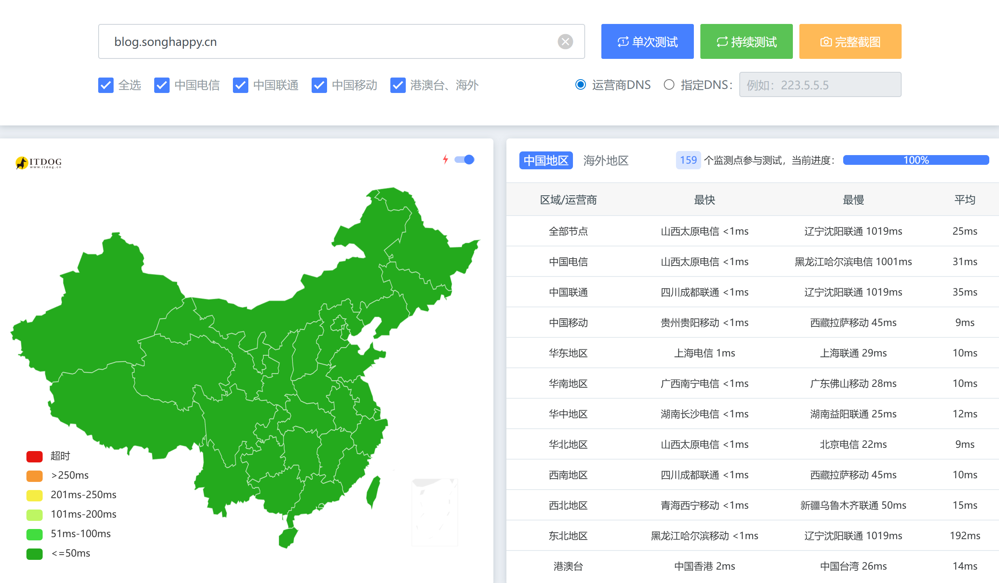
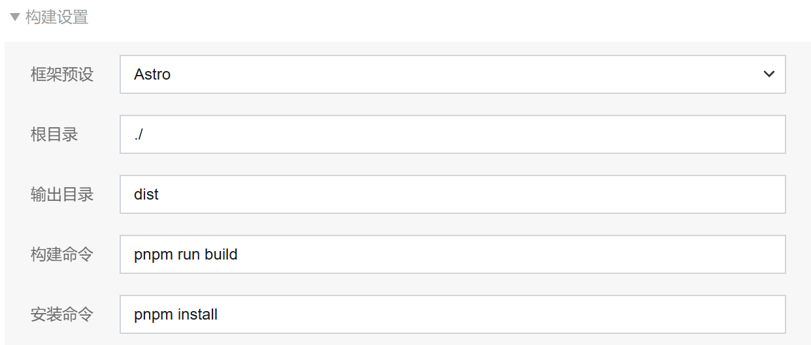

> 之前在halo看到个好看的主题，所以部署了一个非静态网站+CDN，但是后来发现halo的在线编辑器太难用了，导致我也不想写博客，后来发现了Edgeone Pages，使得本地markdown然后直接一个git commit和push就能完成博客
> 我最终还是转向了静态博客~

## 效果



## 搭建过程
使用的主题是saicaca/fuwari
> 非常的简洁，美观


### 创建 Fuwari 博客仓库📦
1. 打开[saicaca/fuwari: ✨A static blog template built with Astro.](https://github.com/saicaca/fuwari) GitHub 仓库
2. 点 **“Generate a new repository / Use this template”**（从模板生成新仓库）
3.  起个仓库名，比如 `myblog`，创建完成后就有自己的博客代码了 ✅


### 把博客跑起来（本地预览）💻
```bash
git clone <你的仓库地址>
cd <你的仓库目录>

# 安装 pnpm（如果你还没装）
npm install -g pnpm

# 安装依赖
pnpm install

# 启动本地开发服务器
pnpm dev
```

### 改站点信息（作者名/头像/社交链接等）🧩
`src/config.ts` 里做主要配置（README 明确写了这里用来定制博客）
`astro.config.mjs` 里 **site/base** 配置自己的域名


### 写一篇博客（两种方式）✍️✨

#### 方式 A（推荐）：用自带命令一键生成文章
```
pnpm new-post hello-fuwari
```
它会帮你生成文章文件，去 `src/content/posts/` 里编辑即可

#### 方式 B：手动新建 Markdown（更可控）
Fuwari 的文章放在：`src/content/posts/`
可以这样组织
```
src/content/posts/
└── hello-fuwari/
    ├── cover.jpg
    └── index.md
```
`index.md` 示例（直接复制改内容就能用）：
```
---
title: 我的第一篇 Fuwari 博客
published: 2025-12-15
description: 这是一篇用 Fuwari + Astro 写的测试文章。
image: ./cover.jpg
tags: [随笔, Astro, Fuwari]
category: 记录
draft: false
---

## 开场白

今天把博客跑起来了 🎉

- 支持 Markdown
- 支持标签/分类
- 支持封面图

后面我会继续优化主题样式～

```


### 部署到Edgeone
Edgeone控制台 -> 创建 Pages 项目 ->连接到github
填成这样即可（一般是自动填充的）



> 之后写完就commit和push到github仓库，这里就会自动构建了

