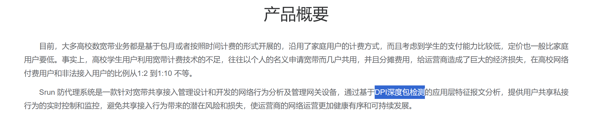

> 注：本文以及本文引用的链接并未教程，只是个人学习的记录，该记录也并未损害任何人的权益
> 部分信息可能由AI生成

## 前言
本篇仅讲述思路以及原理，具体配置流程见
教学区使用的认证系统是[srun官网/防代理系统](https://srun.com/cn/products/proxy)，感觉非常脑残的一个认证系统
宿舍区可以通过直接连接一个路由器来实现多设备共享网络，但是教学区为什么不行呢？
我在教学区的可见设备就有1×Windows，1×Linux，1×Macos，1×平板，2×手机，有时候还要给内网Linux设备联网，通过手机开启热点是一个选择，但是延迟过高，速度过低，还访问不了内网资源，所以找到能够让所有设备都接入校园网的办法迫在眉睫

## 法一 使用Mihomo的TUN模式

经过测试，似乎是仅通过[TTL](https://en.wikipedia.org/wiki/Time_to_live)检测，或者可能是深度包检测成本过高，没有开启，又或者检测不严格，才有了本方法
发现此方法是因为我的一个Linux机器Docker的Bridge模式根本用不了（表现形式就是被srun Waf掉了，只能用Host模式，而开启了v2rayn的TUN之后（不开启任何配置文件），我的Docker的Bridge模式就能用了
> 直接用路由器等NAT不能用校园网的表现是：可以ping（ICMP协议），无法DNS查询（UDP协议）和进行其他操作（TCP等协议）

### 原理：TUN 模式会对数据包进行“清洗”和“重组”
#### 1. TTL (Time To Live) 的“重置”效应

这是最根本的原因。
- **普通 Docker 模式 (Kernel NAT):**
    - 容器发出数据包，TTL = 64。
    - 经过宿主机 Linux 内核转发（NAT），TTL 减 1，变成 **63**。
    - 数据包到达校园网网关。
    - **校园网审计逻辑：** “咦？这个 IP 发出的包怎么一会儿 TTL 是 64（宿主机自己用的），一会儿是 63（容器用的）？肯定开了热点/共享！**封掉！**”
- **TUN 模式 (User-Space NAT):**
    - 容器发出数据包 (TTL=64)。
    - 数据包被路由进 **TUN 网卡**。
    - **关键点：** 此时数据包被你的代理软件（Clash/Sing-box 等）读取。代理软件提取出里面的数据（比如 DNS 请求内容），然后在**宿主机本地**发起一个新的请求。
    - **结果：** 真正从物理网卡发往校园网的那个包，是由代理软件在宿主机上生成的，**TTL 是全新的（默认 64）**。
    - **校园网视角：** “嗯，所有包的 TTL 都是 64，看起来就是这台电脑自己在上网，没问题，**放行。**
#### 2. 协议栈的“洗白” (L3 vs L7)
其实 TUN 模式本身就是一种高级的 NAT（网络地址转换），但它不是在内核层做的，而是在**应用层（用户态）做的。
- **关闭 TUN 时：** Docker 依赖 Linux **内核** 的 `iptables` 进行包转发。内核只管修改 IP头，不管包的特征。如果有协议指纹检测（比如检测 IP ID 序列的不连续性），很容易暴露。
- **开启 TUN 时：**
    - Docker 的包被 TUN 接口“吃掉”。
    - 代理软件解析出：“哦，这是一个要去 `8.8.8.8:53` 的 UDP 包”。
    - 代理软件（即使是直连模式）会用**自己的身份**，通过 `eth0` 创建一个标准的 UDP Socket 发送请求。
    - **效果：** 所有的流量特征（TCP/IP 握手行为、序列号、Window Size 等）都变成了这台 Linux 主机操作系统的标准特征，完全掩盖了后面 Docker 容器的痕迹。

> 还有一个可能是user agent的检测，这里没有写
### 总结
所以，我们可以搭建一个**基于 TUN 技术的透明网关**
这种方案的核心在于：**我们不用 Linux 内核原生的 NAT（iptables masquerade），而是让一个代理软件（Mihomo/Clash Meta）接管所有流量，把转发流量“洗白”成这台机器自己发出的流量。**

## 法二 使用一些加密协议
### 灵感来源
[srun官网/防代理系统](https://srun.com/cn/products/proxy)

srun的官网一直在提这个词，**深度包检测**，似乎他们对这个**情有独钟**，甚至**引以为傲**
诶？我们是不是还在别的地方听过这个词
好耳熟
为什么我想到了Vless？
既然某FireWall的DPI都检测不到的，那么srun一定检测不到啊
这就有了此方案
> 不过不知道为何，我的Vless+tcp+reality用不了；只能用了TUIC+tls

就算srun的DPI火力全开，也无法检测此流量特征

## 两种方法的对比

|           | Mihomo的TUN模式         | 加密协议Vless或者TUIC                                                      |
| --------- | -------------------- | -------------------------------------------------------------------- |
| 是否推荐      | 推荐                   | 中立，可作为备案方案                                                           |
| 性能        | 高                    | 中                                                                    |
| 好用程度      | 很高                   | 中                                                                    |
| 是否需要同一网段  | 需要                   | 不需要                                                                  |
| 是否能搭建内网网站 | Linux可以，其他不行         | 可以                                                                   |
| 抵抗检测能力    | 中                    | 极高                                                                   |
| 备注        | 配置好之后和宿舍区普通的NAT几乎没区别 | 因为使用了加密协议，占用了一个v2ray/clash的软件，所以无法科学上网，除非使用软路由，但这样可能会产生加密协议in加密协议的问题 |
