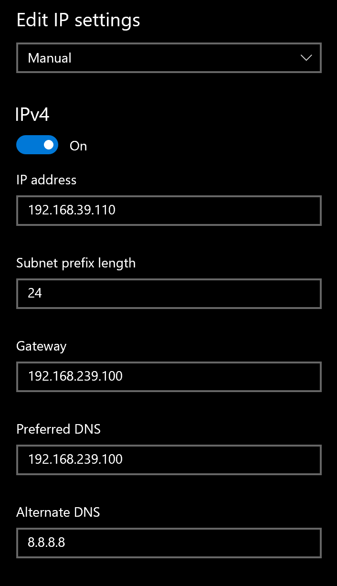

> 注：本文以及本文引用的链接并未教程，只是个人学习的记录，该记录也并未损害任何人的权益
> 部分信息可能由AI生成
# 效果与限制
优点：无需终端设备使用V2ray/Clash等程序，比使用TUIC协议的办法稳定
       Linux终端设备可以经过配置实现内网互通之间用自己的ip，其他类型终端设备除了同网段用自己的ip，其他情况全是出口机的ip
限制：终端设备需要与出口机处于同一网段

# 需要的设备

一台linux机器

# 配置
## 联网
Linux Desktop直接[net.szu.edu.cn](https://net.szu.edu.cn)
Linux Server可以使用[Caterpie771881/szu_srun_client](https://github.com/Caterpie771881/szu_srun_client)
联上网之后如果以后不想自己手动登录可以使用[YusongXiao/szu_srun_client](https://github.com/YusongXiao/szu_srun_client)

## 开启 IP 转发

```bash
echo "net.ipv4.ip_forward=1" >> /etc/sysctl.conf
sysctl -p
```


## 下载并安装 Mihomo

```bash
mkdir -p /etc/mihomo
cd /etc/mihomo
```

然后到[Releases · MetaCubeX/mihomo](https://github.com/MetaCubeX/mihomo/releases)下载适合版本的mihomo（具体下载哪个版本需要参考[FAQ · MetaCubeX/mihomo Wiki](https://github.com/MetaCubeX/mihomo/wiki/FAQ)）
这里使用的是mihomo-linux-amd64-v3-v1.19.17

```bash
wget https://github.com/MetaCubeX/mihomo/releases/download/v1.19.17/mihomo-linux-amd64-v3-v1.19.17.gz
gzip -d mihomo-linux-amd64-v3-v1.19.17.gz
mv mihomo-linux-amd64-v3 mihomo
chmod +x mihomo
```

## 编写配置文件
```bash
nano /etc/mihomo/config.yaml
```
填入以下信息
```
# /etc/mihomo/config.yaml

# 允许局域网连接 (必须)
allow-lan: true
bind-address: '*'

# 这里的端口不重要，因为我们主要靠 TUN
mixed-port: 7890

# 开启 IPv6
ipv6: true

# 日志级别
log-level: info

# --- 核心配置：TUN 模式 ---
tun:
  enable: true
  stack: system       # 使用系统协议栈，兼容性最好
  dns-hijack:         # 劫持 DNS 请求，防止 DNS 污染和泄露
    - any:53
  auto-route: true    # 自动配置路由表，把流量吸进来
  auto-detect-interface: true # 自动检测出口网卡

# --- DNS 配置 ---
# 必须配置，否则客户端无法解析
dns:
  enable: true
  listen: 0.0.0.0:53
  enhanced-mode: fake-ip  # 推荐 fake-ip 模式，响应最快，且能骗过一些检测
  fake-ip-range: 198.18.0.1/16
  nameserver:
    - 223.5.5.5
    - 119.29.29.29
    - 8.8.8.8

# --- 代理节点配置 ---
proxies:
  # 定义一个名为 "DIRECT-PASS" 的节点，类型是直连
  - name: "DIRECT-PASS"
    type: direct

# --- 规则配置 ---
rules:
  # 所有流量都匹配到 DIRECT-PASS，走直连发出
  # 经过这一步，数据包会被 Mihomo 重组，TTL 变为默认值，实现防检测
  - MATCH,DIRECT-PASS
```


## 配置系统服务并启动
```bash
nano /etc/systemd/system/mihomo.service
```
填入以下信息
```text
[Unit]
Description=Mihomo Daemon, another Clash Kernel.
After=network.target NetworkManager.service systemd-networkd.service iwd.service

[Service]
Type=simple
LimitNNOFILE=65536
ExecStart=/etc/mihomo/mihomo -d /etc/mihomo -f /etc/mihomo/config.yaml
Restart=always

[Install]
WantedBy=multi-user.target
```
启动并设置开机自启：
```bash
systemctl stop systemd-resolved         # 关闭系统自带的DNS解析，因为mihomo要用53端口
systemctl disable systemd-resolved

systemctl enable mihomo
systemctl start mihomo

systemctl daemon-reload
```

## 防火墙设置
```bash
# 如果是 Ubuntu/Debian
ufw disable

# 如果是 CentOS/RedHat
systemctl stop firewalld
```


# 终端设备的配置
这里假设上面配置的linux机器的内网ip为192.168.239.100

确保连接的是校园网（非SZU_GUEST，因为GUEST网络只有登录才能访问内网）
连接好会分配一个内网ip，假设这里是192.168.239.110

需要为终端设备配置静态ip
需要填的信息


## Windows
设置 -> 网络 -> 状态 -> 性质 -> ip设置 -编辑




|           |                           |
| --------- | ------------------------- |
| ip地址      | 192.168.239.110           |
| 子网掩码/子网前缀 | 24/255.255.255.0          |
| 网关/路由     | 192.168.239.100           |
| DNS       | 192.168.239.100 (8.8.8.8) |
> / 表示有哪个就填哪个


## 手机
和上面同理，照着配就行


## Linux
两种办法
### nat与bridge共存，即内网走自己的ip，公网走出口ip（推荐）

先`ip a`看网卡名称
记录自己DHCP得到的ip以及连接到网络的网关
比如，这里的DHCP得到的ip是192.168.239.110，网关是192.168.239.33

```bash
sudo nano /etc/netplan/01-netcfg.yaml
```
填入以下信息
> 网卡名称ens160替换成自己的，ip 192.168.239.110替换成DHCP得到的的，网关192.168.239.33替换成DHCP得到的，192.168.239.175替换成前面部署的机器的
```text
network:
  version: 2
  renderer: networkd
  ethernets:
    ens160:
      dhcp4: no
      addresses:
        - 192.168.239.110/24
      nameservers:
        addresses: [192.168.239.175, 8.8.8.8]
      routes:
        # 外网默认出口：走 175
        - to: default
          via: 192.168.239.175

        # 内网网段：走原本的路由器 33（不要写成本机IP！）
        - to: 172.16.0.0/12
          via: 192.168.239.33
        - to: 192.168.0.0/16
          via: 192.168.239.33
```

```bash
sudo netplan apply
```

### nat模式，内网公网均走出口ip

```bash
nano /etc/netplan/01-netcfg.yaml
```
填入以下信息
```text
network:
  version: 2
  ethernets:
    ens160:
      dhcp4: false
      addresses:
        - 192.168.239.110/24
      nameservers:
        addresses:
          - 192.168.239.100
          - 8.8.8.8
      routes:
        - to: 0.0.0.0/0
          via: 192.168.239.100
```

```bash
sudo netplan apply
```

至此，配置完毕