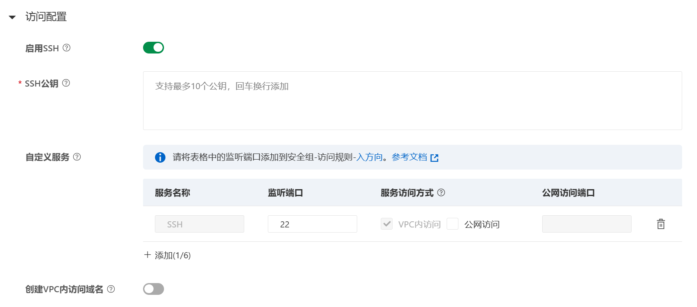

## 配置

初次配置过程比较繁琐
需要先配置一个VPC，安全组和交换机
> 之前用学生认证在阿里云拿了一个免费的ECS，有一个VPC，直接连上即可

公网访问网关选择了公有网关，要不然还要**收费**
下面的配置端口是否开启公网访问，如果要开启又要去**配置收费项目**

所以这里选择**关闭**
但是！
刚才我们把一个**有公网ip的ECS**和**PAI-DSW**放到了一个VPC内，他们之间是内网互通的，直接把**ECS当跳板机**就行了


> 至此，如果要拿到172.23.168.196的ssh简单，先直接ssh到120.79.xxx.xxx，再从当前命令行ssh到172.23.168.196
> 但是传文件有点复杂，没法直接sftp到172.23.168.196，需要先sftp到120.79.xxx.xxx，再sftp到172.23.168.196（并且这一步是没有UI的，不能直接在Termius的SFTP中使用，挺麻烦）

想到**搭隧道**
先考虑能使用的最小化方案，先弄两个端口即可，一个**ssh22**，一个**web8080**
两种办法，ssh端口转发，frp内网穿透
### ssh端口转发（简单但不稳定）

在本地使用以下命令把22端口传出来
```
ssh -L 7777:172.23.168.196:22 root@120.79.xxx.xxx
```
然后访问127.0.0.1:7777就相当于172.23.168.196:22，直接在Termius中添加主机即可，传文件用SFTP也方便

8080端口同理
```
ssh -L 7778:172.23.168.196:8080 root@120.79.xxx.xxx
```

### frp
内网穿透，老生常谈了的
阿里云的PAI-DSW环境本身就是容器，无法再用docker程序，所以这里直接使用二进制运行


在ECS上frps.tomlo
```toml
# bindPort 直接写在最上面，不要放在 [common] 里
bindPort = 7002

# auth 部分的写法是正确的 TOML 格式，可以保留
[auth]
method = "token"
token = "yourawsometoken"
```

在PAI-DSW上frpc.toml
```toml
serverAddr = "172.23.168.195"
serverPort = 7002

[auth]
method = "token"
token = "yourawsometoken"

{{- range $_, $v := parseNumberRangePair "22,80,8080,32768,3389" "10022,10080,18080,42768,13389" }}
[[proxies]]
name = "tcp-{{ $v.First }}"
type = "tcp"
localPort = {{ $v.First }}
remotePort = {{ $v.Second }}
{{- end }}
```
> 这里的意思是穿了5个端口22,80,8080,32768,3389分别到10022,10080,18080,42768,13389
> 也有其他写法，这里仅供参考

使用nohup运行在后台
```bash
nohup ./frpc -c frpc.toml >/dev/null 2>&1 &
```

**至此，配置完毕**
如果要访问172.23.168.195:22的话，访问120.79.xxx.xxx:10022即可，其他端口同理

> 要注意不要有端口冲突
> 还有云服务器安全组要放行，跳板机上如果有ufw也要放行


## 使用
### pypi内网阿里云源
前面选择的是共享带宽，实测上下行都是**10Mbps**，特别慢，所以pypi源也不要用https://mirrors.aliyun.com/pypi/simple/了，用内网http://mirrors.cloud.aliyuncs.com/pypi/simple/
，比如
```
pip install -r requirements.txt -i http://mirrors.cloud.aliyuncs.com/pypi/simple/ --trusted-host mirrors.cloud.aliyuncs.com
```

### OSS
两种方法
1. 直接挂载，然后在/mnt/data目录下拿文件，即可享受内网高速传输速率
2. 使用内网域名，比如`https://songhappypicture.oss-cn-shenzhen.aliyuncs.com/pai/abc.safetensors`的域名替换成
`songhappypicture.oss-cn-shenzhen-internal.aliyuncs.com`即可享受高速下载（超过1000Mbps）


