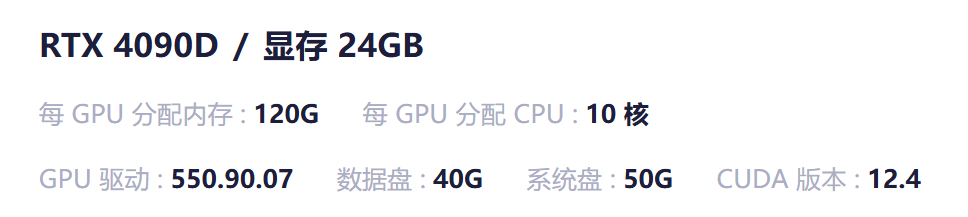
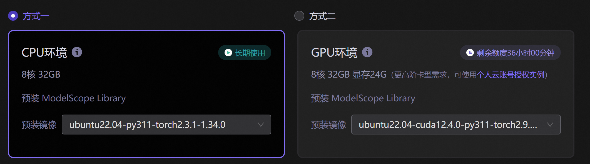
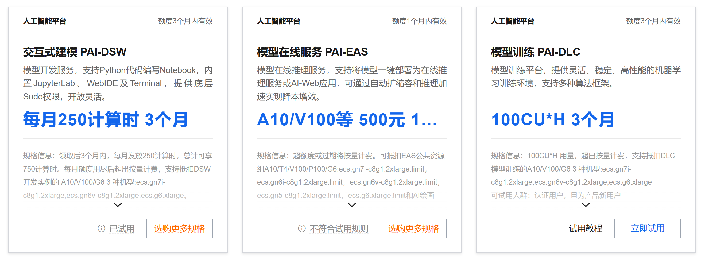
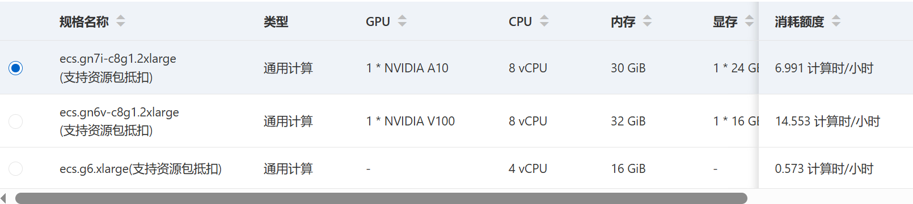
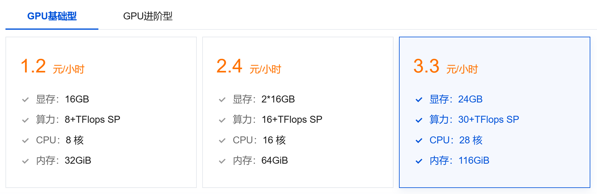

## 前言
想玩一下AI生图，SDXL等
还想着LoRA微调一下，生成自己想要的风格

---

## 算力来源
### 1. CSDN
[星图 - 一站式AI算力与镜像服务平台 | 镜像市场 | 算力租赁 | 容器部署](https://ai.csdn.net/compute-power)

1.46元/h，还算便宜

### 2. modelscope
[我的Notebook · 魔搭社区](https://www.modelscope.cn/my/mynotebook/preset)

免费36h
根据24GB显存，个人推测是A10 GPU

### 3. 阿里云PAI平台
[交互式建模（DSW）](https://pai.console.aliyun.com/?regionId=cn-shenzhen&workspaceId=272403#/notebook)

免费试用能用3个月

### 4. 腾讯云HAI平台
[高性能应用服务购买_高性能应用服务选购 - 腾讯云](https://buy.cloud.tencent.com/hai?applicationId=app-2xilycjt&applicationType=sc-8yplri58&regionId=8&bundleId=24GB_A&diskSize=200)

HAI的好处是每次开机给一个随机的公网ip，不用自己配置繁琐的VPC网络

> 我这里使用的是 3. 阿里云PAI平台，不过需要配置一下VPC网络，具体可见https://blog.songhappy.cn/pai

---

## 数据集来源
> 想要什么自己爬

参考 https://blog.songhappy.cn/douyin_spider 和 [YusongXiao/douyin_downloader](https://github.com/YusongXiao/douyin_downloader)
LoRA微调还没搞过，本篇待更新

